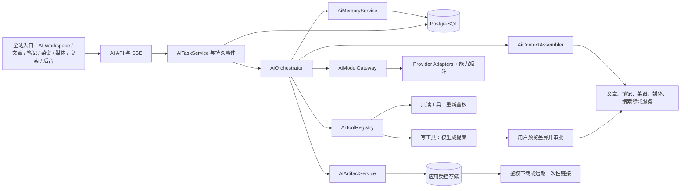

# BlogDemo AI-first 一年修复、优化与功能拓展路线图

> 审查与重排基准：2026-08-10
>
> 执行周期：2026-08 至 2027-07，共 12 个四周执行窗口
>
> 项目路径：D:/Office/Study/code/BlogDemo
>
> 配套执行提示词：docs/prompts/annual-roadmap-agent-prompts-2026-08-10.md
>
> 本版已把原年度修复路线、原 M9 AI 工作台计划和最新“AI 服务整个网站”需求合并重排。旧任务没有删除，映射见第 12 节。

## 1. 执行结论

年度第一优先级改为建设网站级 AI 服务层，而不是继续给聊天框叠加功能。

M1 必须先交付一个可真实使用的多模态闭环：

1. 上传图片并让模型理解；
2. 上传 PDF、DOCX、TXT、Markdown、CSV 等受支持文件并让模型处理；
3. 建立以应用数据库为事实源、可查看和删除的真实记忆；
4. 生成 Markdown、TXT、JSON、CSV 和图片等产物；
5. 从应用受控存储下载产物；
6. 任务、事件、文件、记忆和产物在应用重启后仍可恢复。

M2 把上述能力接入文章、笔记、菜谱、媒体、搜索和后台，而不要求用户先进入聊天页。M3 补齐知识检索、领域工具审批、可靠性、评测和安全门禁。原路线图中的迁移、部署、任务可靠性、模块化、E2E、安全、创作、搜索、图谱、厨房和灾备仍在 M4–M12 完成。

这里的“服务整个网站”是指同一套 AI 任务、上下文、记忆、工具和产物能力被各业务模块复用。首版仅面向已登录且具备相应能力的站点所有者或后台用户，不等于向匿名访客开放公共 AI。

### 1.1 优先级顺序

| 优先级      | 主题                                                 | 决策                                  |
| ----------- | ---------------------------------------------------- | ------------------------------------- |
| P0-AI       | 图片、文件、真实记忆、文件生成与下载                 | M1 完成最小但完整的端到端闭环         |
| P0-Safety   | 权限隔离、受控存储、迁移测试、并发、取消、审计、删除 | 与 M1–M3 同步实现，不能留到“以后加固” |
| P1-Agent    | 文章、笔记、菜谱、媒体、搜索、后台领域工具           | M2–M3 完成，聊天只是一个入口          |
| P1-Platform | 数据、部署、任务、E2E、安全供应链和 SLO              | M4–M7 完成                            |
| P2-Product  | 创作、搜索、图谱、厨房和 PWA                         | M8–M11 完成                           |
| P1-Closeout | 灾备、性能、可访问性和年度审计                       | M12 完成                              |

### 1.2 分阶段开放

| 阶段              | 时间         | 可用范围                             | 必须满足                                                     |
| ----------------- | ------------ | ------------------------------------ | ------------------------------------------------------------ |
| Internal Alpha    | M1 结束      | 本地或测试环境中的管理员             | 多模态、真实记忆、基础产物闭环和跨用户隔离通过               |
| Site Beta         | M2 结束      | 已登录站点管理者，从多个业务页面进入 | 领域上下文、提案审批、来源引用和富产物通过                   |
| Release Candidate | M3 结束      | 隔离全栈环境                         | 可恢复任务、知识检索、离线评测、注入和故障测试通过           |
| Production GA     | 最早 M5 结束 | 生产中的授权用户                     | M4 数据/部署门与 M5 全栈可靠性门全部通过，并另行获得部署授权 |

功能完成和生产开放是两件事。M1 要先完成用户价值，但生产开关默认关闭，不能绕过迁移、备份和发布门。

### 1.3 实施进度（2026-08-13 实时更新）

| 月份 | 状态 | 结果与证据 | 下一月门 |
| ---- | ---- | ---------- | -------- |
| M1 | **完成并发布：Internal Alpha；生产功能关闭** | 新增 V53 与网站级 `com.yubai.blog.ai`；PNG/PDF/DOCX/Markdown/CSV parts 真实进入本地 fake Responses HTTP；真实记忆、四类文本/数据产物和现有 AI 图片产物、owner 隔离、恢复/事件回放、过期清理与兼容回归通过；最终发布门禁后端 755、前端 811 个测试通过；提交 `5bcc83c` 以标签 `v1.1.0-ai-platform-m1` 部署成功 | **M2 可启动：YES**；Production GA 仍为 **NO** |
| M2–M7 | **完成；Production GA 仍关闭** | 全站 Agent/领域入口、知识与可靠性、公开质量、数据与发布安全、任务/模块化、全栈 E2E/安全供应链/SLO checkpoints 已落库并分别完成验证；M7 的 fake-provider 全栈 Chromium、Firefox、移动端和安全门已通过 | **M8 可启动：YES** |
| M8 | **完成；未自动发布/未部署** | 创作预览、统一媒体库、发布质量门、文章乐观锁差异、AI 候选提案与审批保护完成；V57–V59、`docs/checkpoints/m8-authoring-media-2026-08-13.md`，后端/前端/迁移 manifest 验证通过 | **M9 可启动：YES**；Production GA 仍为 **NO** |
| M9 | **完成；未自动发布/未部署** | categories 路由契约、URL 可复现 typed search、中文规范化与零结果评测、GlobalSearch/SearchPage/AI 只读工具统一查询语义、公开/登录笔记隔离、匿名哈希/零结果/延迟/点击指标完成；V60、`docs/checkpoints/m9-search-retrieval-2026-08-13.md`，OpenAPI/前端类型同步并通过集成回归 | **M10 可启动：YES**；Production GA 仍为 **NO** |
| M10 | **完成；未自动发布/未部署** | V61 显式关系与审计、反向链接、后台 CRUD/导入预览、AI 关系 proposal/领域服务审批、列表等价视图、schemaVersion 2.0 导出、1,000 节点确定性/性能基准完成；`docs/checkpoints/m10-graph-relations-2026-08-13.md`，OpenAPI/前端类型与迁移 manifest 同步并通过回归 | **M11 可启动：YES**；Production GA 仍为 **NO** |
| M11 | **完成；未自动发布/未部署** | V62 持久化周购物清单、同单位归并、来源/原始数量快照、勾选/分类/手工项/备注/清理、乐观锁、删除菜谱后快照保留、静态常备项建议、私有 PWA 缓存边界和有界离线队列完成；后端 817、前端 835 测试，全量构建与 Chromium/Firefox/移动 Chromium 在线 E2E 7/7 通过；`docs/checkpoints/m11-kitchen-pwa-2026-08-13.md` | **M12 可启动：YES**；Production GA 仍为 **NO** |
| M12 | **本地年度验收完成；生产部署待外部门禁** | 隔离 V62 DB/存储恢复与 checksum/数量/hash/Flyway/query audit 通过，实测 RTO 8.8s；后端 817、前端 835、公开关键页 Axe Chromium 14/14、Firefox 9/9、全栈认证后台/AI/媒体/图谱 Chromium+Firefox 10/10；无 serious/critical Axe 违规；构建 49 JS/1,500,807 bytes、PWA 100 entries、迁移 manifest 与依赖审计通过。详细证据见 `docs/checkpoints/m12-annual-audit-2026-08-13.md` 与 `docs/annual-audit-2027-07.md` | **Production GA：NO**；需生产环境 reviewer/secrets/known-host 与真实备份、线上指标、人工读屏抽查后再发布 |

M1 的完整证据、文件范围、风险和未执行项见
[`docs/checkpoints/m1-ai-multimodal-memory-artifacts-2026-08-10.md`](checkpoints/m1-ai-multimodal-memory-artifacts-2026-08-10.md)。2026-08-10 发布跟进已完成 commit、push、迁移前备份、V51→V53 生产迁移、原子部署和线上冒烟；四个后端开关与前端 Workspace 开关继续关闭，未开放 Production GA，未执行真实模型调用。

## 2. 产品边界与非目标

### 2.1 本年度范围

- 一个网站级 AI Workspace，以及文章、笔记、菜谱、媒体、搜索、图谱和后台的上下文入口；
- 文本、图片和常见文档输入；
- 会话工作记忆、用户确认的长期记忆、带权限的网站知识记忆；
- 结构化工具调用、来源引用、变更提案、差异预览和人工审批；
- 应用托管的生成文件与安全下载；
- 可恢复任务、SSE 事件回放、取消、重试、配额、成本和审计；
- provider 能力矩阵，支持现有 OpenAI-compatible、OpenAI Responses、Anthropic 和 OpenCode 适配器逐步接入。

### 2.2 明确不做

- 不操控浏览器所在电脑的本地文件系统；
- 不接受 file://、Windows/Unix 绝对路径、目录路径或任意服务器路径作为 AI 输入；
- 不向模型提供 shell、任意代码执行、任意 URL 抓取或任意数据库访问工具；
- 不允许模型直接调用 repository、写 SQL、修改权限、管理凭据、物理删除或发布内容；
- 不自动保存敏感长期记忆，不把 provider 会话 ID 当作真实记忆；
- 不提供永久公开裸下载链接；
- 不默认开放匿名公共 AI，不在本年度默认引入多租户、微服务、Redis、消息队列或多 Agent 自治。

服务端可以管理用户通过网站上传的文件和 AI 生成物，但只通过应用签发的 fileId、artifactId 和权限校验访问。这与“操控用户本地文件”是完全不同的能力。

## 3. 2026-08-10 事实基线

### 3.1 仓库与平台

| 项目     | 当前事实                                                                                         |
| -------- | ------------------------------------------------------------------------------------------------ |
| 前端     | Vue 3.5、TypeScript 5.9、Vite 8、Pinia、Vitest、Playwright、PWA                                  |
| 后端     | Java 21、Spring Boot 3.5.16、Spring Security、JPA、Flyway、PostgreSQL                            |
| 部署     | nginx 静态前端 + 单实例 Spring Boot + PostgreSQL，systemd 与 GitHub Actions                      |
| 工作树   | 重排时 git status 约 277 项；包含大量用户和其他 Agent 的未提交内容                               |
| 数据库   | 当前仓库最高迁移文件为 V52，且 V48–V52 仍是未跟踪工作树内容                                      |
| 历史验证 | 2026-08-10 台账记录前端 806 个测试、后端 737 个测试通过；执行 Agent 必须重新实测，禁止复用旧数字 |

任何 Agent 开始前都必须动态扫描迁移目录和 git 状态。当前“下一个候选迁移”表面上是 V53，但只有在 V48–V52 已核对、目标库 flyway_schema_history 一致、没有其他批次占号后才能使用。

### 3.2 当前 AI 实现

| 能力             | 已有事实                                                                                             | 缺口                                                                          |
| ---------------- | ---------------------------------------------------------------------------------------------------- | ----------------------------------------------------------------------------- |
| 文本聊天         | AdminAiController、AiChatService、多个 provider client 和 SSE 已存在                                 | ChatMessage 只有 role/content，仍是纯文本模型                                 |
| OpenAI Responses | OpenAiResponsesClient 已接入 /responses 和文本流                                                     | 只发送 input_text/output_text，未保留图片、文件、工具、引用和产物事件         |
| 聊天历史         | V46 创建 ai_chat_sessions 与 ai_chat_messages                                                        | 只有角色和正文，不是真实记忆，也不能表达结构化 parts                          |
| 前端             | AdminAiChat.vue 约 1,094 行；全页模式可保存历史                                                      | compact/pet 状态仍主要依赖 sessionStorage；组件难以承载任务、附件、审批和产物 |
| 图片生成         | AiImageService、OpenAiImageClient 和应用存储已存在                                                   | 图生图参考图不等于聊天中的图片理解；生成图片未统一为通用 artifact             |
| 图片资源安全     | 图片会话列表已按 owner 隔离                                                                          | 单图片 content/delete 当前只按 publicId 查询；V47 无外键，DB 失败仍有孤儿窗口 |
| 存储             | StorageService、LocalFileStorage、附件与菜品图片已有路径、symlink、MIME、magic bytes、尺寸和配额防护 | NoteAttachmentService 绑定 note 且偏图片，不能直接当通用 AI 文件服务          |
| 用量与可靠性     | AiUsageService、AiCallReliabilityPolicy、SSRF 与 bounded response 已有基础                           | AI SSE 使用无界 virtual-thread-per-task，没有全局/每用户硬并发门              |
| SSE              | delta/done/error 和心跳已存在                                                                        | 事件不持久，无法 Last-Event-ID 重连或任务重启恢复                             |

> 上表是 M1 开始前的审查基线。M1 完成后的实现事实以 1.3、V53、AI 平台 ADR、数据字典和 M1 checkpoint 为准。

### 3.3 必须保留并复用

- 现有认证、角色和 capability 机制；
- StorageService 与 LocalFileStorage 的受控根目录、原子写入、路径穿越和 symlink 防护；
- NoteAttachmentService、DishAssetService、AiImageService 中的 MIME、magic bytes、图像尺寸、SHA-256 和配额思路；
- AiProviderService、AiUsageService、AiCallReliabilityPolicy、Base URL/SSRF 防护和错误脱敏；
- OpenAPI → TypeScript 类型链路；
- 文章、笔记、菜谱、媒体和发布的现有业务 service；
- 现有 ai_chat_sessions/messages，先兼容再迁移，不改写 V46。

## 4. 目标架构

### 4.1 核心服务职责

| 组件               | 单一职责                                                         |
| ------------------ | ---------------------------------------------------------------- |
| AiTaskService      | 创建、查询、取消、幂等、状态转换、重启恢复                       |
| AiTaskEventService | 持久化有序事件，支持 afterSequence 与 Last-Event-ID              |
| AiOrchestrator     | 组装一次运行、执行有限工具循环、处理审批暂停和终态               |
| AiContextAssembler | 按权限和 token 预算组装页面对象、记忆、知识和最近消息            |
| AiModelGateway     | 根据显式能力路由 provider，统一请求/响应 parts，不按模型名猜能力 |
| AiToolRegistry     | 注册严格 JSON schema、权限、风险等级和结果上限                   |
| AiFileService      | 上传、校验、隔离、引用、保留、删除和 provider 临时文件生命周期   |
| AiArtifactService  | 登记、转存、校验、下载、过期、清理和孤儿修复                     |
| AiMemoryService    | 提案、确认、召回、编辑、禁用、遗忘和派生数据清理                 |
| AiKnowledgeService | 文档分块、来源锚点、权限过滤、检索与索引重建                     |
| AiApprovalService  | 绑定任务、用户、参数哈希、对象版本、有效期和 nonce 的一次性审批  |
| AiPromptRegistry   | 模板、版本、输入 schema、默认参数、owner 和评测集映射            |

新核心应位于网站级 com.yubai.blog.ai 领域，现有 com.yubai.blog.admin.ai 先作为 provider/兼容实现被包装，不在 M1 做一次性大搬家。

## 5. 核心数据、状态与 API 契约

### 5.1 建议数据模型

| 表/聚合                | 最小字段与约束                                                                                            | 首次实现 |
| ---------------------- | --------------------------------------------------------------------------------------------------------- | -------- |
| ai_sessions            | owner、title、mode、summary、version、createdAt、updatedAt                                                | M1       |
| ai_tasks               | owner、sessionId、type、status、provider/model、idempotencyKey、startedAt、finishedAt、errorCode、version | M1       |
| ai_task_parts          | taskId、sequence、role、kind、text/payload、fileId、artifactId、sourceRef                                 | M1       |
| ai_task_events         | taskId、sequence、eventType、sanitizedPayload、createdAt；唯一 taskId+sequence                            | M1       |
| ai_files               | owner、storageKey、name、mediaType、size、sha256、status、retention、expiresAt、referenceCount            | M1       |
| ai_artifacts           | owner、taskId、storageKey、name、mediaType、size、sha256、status、expiresAt                               | M1       |
| ai_memories            | owner、scope、kind、content、sourceTaskId/sourceRef、status、confidence、expiresAt、version               | M1       |
| ai_action_proposals    | taskId、owner、toolName、argsHash、targetType/id/version、status、expiresAt、nonceHash                    | M2       |
| ai_prompt_templates    | templateId、version、purpose、inputSchema、modelConfig、owner、active                                     | M3       |
| ai_knowledge_documents | owner、sourceType/id/version、fileId、status、visibility、checksum                                        | M3       |
| ai_knowledge_chunks    | documentId、ordinal、anchor、content、searchData、optionalEmbedding                                       | M3       |

字段名允许在实现时按仓库规范调整，但所有权、状态、来源、版本、保留期和唯一约束不能省略。

### 5.2 状态机

- 任务：QUEUED → RUNNING → WAITING_APPROVAL → RUNNING → COMPLETED；
- 任务任意非终态可到 FAILED 或 CANCELLED，终态不可复活；
- 文件：UPLOADED → VALIDATING → READY，失败到 REJECTED，保留期结束到 EXPIRED，再到 DELETED；
- 产物：PENDING → READY 或 FAILED，之后可到 EXPIRED/DELETED；
- 长期记忆：PROPOSED → ACTIVE；也可 REJECTED、DISABLED 或 DELETED；
- 变更提案：PROPOSED → APPROVED/REJECTED/EXPIRED；APPROVED 经再次鉴权后到 EXECUTED 或 CONFLICTED。

每次状态转换必须由服务端校验并写审计。取消、超时、完成竞态只能落成一个终态。

### 5.3 事件契约

首版至少包含：

- task.started
- message.delta
- message.completed
- tool.proposed
- tool.started
- tool.completed
- approval.required
- artifact.created
- memory.proposed
- task.completed
- task.failed
- task.cancelled

事件必须有 taskId、sequence、eventType、createdAt 和最小脱敏 payload。重连使用 Last-Event-ID 或 afterSequence，不能依赖浏览器内存补齐。

### 5.4 API 轮廓

| 方法与路径                                     | 用途                                                     |
| ---------------------------------------------- | -------------------------------------------------------- |
| POST /api/v1/ai/files                          | multipart 上传，返回受控 fileId                          |
| GET /api/v1/ai/files/{id}                      | 查询校验、解析和保留状态                                 |
| DELETE /api/v1/ai/files/{id}                   | 删除未引用文件或发起安全删除                             |
| POST /api/v1/ai/tasks                          | 创建任务，输入只接受结构化 parts、contextRefs 和 fileIds |
| GET /api/v1/ai/tasks                           | 按 owner 分页列出任务                                    |
| GET /api/v1/ai/tasks/{id}                      | 查询任务快照                                             |
| GET /api/v1/ai/tasks/{id}/events               | 事件回放                                                 |
| GET /api/v1/ai/tasks/{id}/events/stream        | SSE 续传                                                 |
| POST /api/v1/ai/tasks/{id}/cancel              | 幂等取消                                                 |
| POST /api/v1/ai/proposals/{id}/approve         | 一次性审批并执行现有领域 service                         |
| POST /api/v1/ai/proposals/{id}/reject          | 拒绝提案                                                 |
| GET/POST/PATCH/DELETE /api/v1/ai/memories      | 记忆查看、创建、编辑、禁用和遗忘                         |
| GET /api/v1/ai/artifacts/{id}                  | 查询产物状态                                             |
| GET /api/v1/ai/artifacts/{id}/download         | 登录态受控下载                                           |
| POST /api/v1/ai/artifacts/{id}/download-ticket | 可选的短期一次性下载票据                                 |

Provider 配置、密钥和模型管理继续留在管理员 API；普通 AI 任务 API 永远不返回 provider 密钥。

## 6. 四项首要能力的详细设计

### 6.1 图片与文件上传、理解

#### M1 必须支持

| 类型            | 处理方式                                                                          | 来源锚点            |
| --------------- | --------------------------------------------------------------------------------- | ------------------- |
| JPEG、PNG、WebP | magic bytes + 解码 + 尺寸/像素限制；作为 image part 发送给具备 VISION 的 provider | 图片级              |
| PDF             | 页数、大小和结构限制；优先使用 provider FILE_INPUT，必要时受控提取                | 页码                |
| DOCX            | 只允许无宏 OOXML；限制 ZIP entry 数和解压总量；发送给支持 provider 或安全提取     | 段落                |
| TXT、Markdown   | 严格 UTF-8、字符数和 token 上限                                                   | 行或段落            |
| CSV             | 编码、行列和单元格上限；不执行公式                                                | 行列                |
| JSON            | 大小和深度上限；作为文本/结构化数据                                               | JSON Pointer 或路径 |

M2 再增加 PPTX、XLSX 和更丰富的富文档解析。压缩包、可执行文件、脚本、宏文档、加密文档和 SVG/HTML 主动内容首版拒绝，不静默当纯文本。

#### 上传不变量

- 前端只能把用户选择的字节上传到网站，后续请求只传 fileId；
- extension、声明 MIME 和 magic bytes 不一致时拒绝或隔离；
- 默认可配置上限：单图片 10 MiB、单文档 20 MiB、每任务 5 个文件、总计 50 MiB；执行时可按仓库配置调整并写测试；
- 图片限制总像素，PDF 限页数，OOXML 限 entry 数和总解压量，文本限字符和 token；
- 每个文件记录 owner、SHA-256、size、mediaType、status、retention 和引用；
- 去重只复用物理字节，不暴露其他用户是否上传过同一文件；
- 每次处理和下载前重新鉴权；
- 私有正文、原始文件名、storageKey 和本机路径不进入普通日志；
- 上传失败、任务取消、provider 临时副本和孤儿记录都由 reconciler 清理。

### 6.2 真实记忆

真实记忆必须以 BlogDemo 数据库为事实源。provider conversation、previous response ID、浏览器 localStorage/sessionStorage 和聊天历史都只能是传输或 UX 优化，不能替代应用记忆。

| 层级         | 用途                                     | 写入规则                         | 默认保留             |
| ------------ | ---------------------------------------- | -------------------------------- | -------------------- |
| 工作记忆     | 当前任务和最近消息                       | 任务运行产生，可重建             | 随会话或 30 天       |
| 会话摘要     | 压缩较长会话                             | 服务端生成，用户可查看和清除     | 随会话               |
| 用户长期记忆 | 偏好、目标、稳定事实和工作方式           | 模型只能提出；用户确认后 ACTIVE  | 直到禁用、到期或删除 |
| 网站知识记忆 | 文章、笔记、菜谱和上传文件中的可检索知识 | 用户显式纳入，始终保留来源和权限 | 随源对象/策略        |

长期记忆最少包含 owner、scope、kind、content、source、status、version 和可选 expiresAt。默认 PROPOSED，未经确认不进入后续上下文。

上下文固定顺序：

1. 系统与安全策略；
2. 当前页面业务对象的版本化快照；
3. 已确认长期记忆；
4. 经权限过滤的知识检索结果；
5. 会话摘要；
6. 最近消息和本次上传。

每层使用独立 token 预算，超限时按来源和相关性裁剪并向用户说明。删除或“忘记”必须清除正文、索引、embedding、摘要缓存和派生副本；审计最多保留不含正文的删除事件元数据。

### 6.3 文件和图片生成

M1 统一现有图片生成和新文本产物为 artifact：

- Markdown
- TXT
- JSON
- CSV
- 已有 AI 生成图片

M2 基于明确业务模板增加 PDF、DOCX、XLSX；不得承诺任意格式转换。若 provider 的 Code Interpreter 或其他临时容器生成文件，任务完成前必须立即复制到 BlogDemo 自有存储，因为上游容器和链接可能过期。

产物发布流程：

1. 创建 PENDING 元数据；
2. 在临时命名空间生成并校验大小、MIME 和 SHA-256；
3. 原子移动到正式 storageKey；
4. 将状态改为 READY 并发送 artifact.created；
5. 下载时重新校验 owner/能力、状态和保留期；
6. 过期进入 EXPIRED，清理器删除字节并保留最小审计；
7. reconciler 处理“有文件无记录”和“有记录无文件”。

下载响应必须使用安全 Content-Disposition、准确 MIME、X-Content-Type-Options: nosniff 和 private/no-store。HTML、SVG 等主动内容即使以后支持，也只能 attachment 下载，不能在同源后台直接内联执行。

### 6.4 全站领域工具

第一批工具控制在 6–10 个高价值工具，不开放任意 SQL、任意 HTTP 或 shell。

| 领域 | 只读工具示例                         | 写入提案示例                     |
| ---- | ------------------------------------ | -------------------------------- |
| 文章 | 读取草稿、检索相关文章、读取发布检查 | 提议标题/摘要/标签/SEO/正文 diff |
| 笔记 | 读取笔记与附件、检索相关知识         | 提议摘要、知识点或关联           |
| 菜谱 | 读取菜谱、菜单和导入预览             | 提议规范化字段、步骤或购物信息   |
| 媒体 | 读取图片元数据和引用                 | 提议 alt、caption、许可说明      |
| 搜索 | 权限安全的站内搜索                   | 无直接写入                       |
| 后台 | 读取内容统计、失败任务和待办         | 提议生成报告或任务清单           |
| 图谱 | 读取关系和反向链接                   | M10 才开放关系候选提案           |

写工具只能生成 proposal。审批必须绑定 taskId、userId、toolName、argsHash、targetVersion、expiresAt 和一次性 nonce。执行时重新鉴权、重新检查目标版本，并调用现有领域 service；版本变化时进入 CONFLICTED，不能静默覆盖。

自动发布、物理删除、权限/凭据修改始终禁止。Prompt 中的“请直接执行”不能提升权限。

## 7. Provider 能力与降级策略

每个 provider 配置显式声明并经测试确认以下能力：

- TEXT
- VISION
- FILE_INPUT
- FUNCTION_CALLING
- STRUCTURED_OUTPUT
- CODE_INTERPRETER
- FILE_SEARCH
- IMAGE_GENERATION
- STATEFUL_CONVERSATION

默认保守：没有声明的能力视为不支持。禁止根据模型名称猜测能力，也禁止图片/文件被悄悄丢弃后只发送文本。

路由规则：

1. 根据任务所需能力筛选；
2. 再根据用户选择、预算、健康状态和数据策略选择 provider；
3. 没有匹配项时返回可操作的能力错误；
4. failover 只能发生在能力、隐私和语义等价的请求上；
5. 每次运行记录 provider、model、能力快照、模板版本、token、成本、延迟、失败和 failover 原因。

## 8. 安全、隐私与保留策略

| 风险             | 强制控制                                                                          |
| ---------------- | --------------------------------------------------------------------------------- |
| 跨用户读取       | 所有 file、task、memory、artifact、contextRef 和 proposal 查询都带 owner/能力条件 |
| Prompt injection | 系统策略、可信元数据与不可信正文分层；工具权限由服务器控制，不靠提示词保证        |
| 文件攻击         | MIME/magic/解码、大小/页数/像素/解压限制，首版拒绝可执行、宏和任意压缩包          |
| 未经确认写入     | 只读工具与写提案分离；审批绑定参数哈希和对象版本                                  |
| 记忆过度收集     | 长期记忆需确认，敏感属性默认拒绝，支持查看、禁用、删除和到期                      |
| 临时链接失效     | 上游产物立即转存到应用存储，应用自己签发下载                                      |
| 资源耗尽         | 每用户/全局并发、队列深度、输入/输出字节、token、成本和磁盘配额                   |
| 日志泄漏         | 不记录 key、token、文件正文、私有上下文、storageKey 或记忆正文                    |
| 重试副作用       | idempotencyKey、唯一约束、终态 CAS、artifact/proposal 幂等                        |
| 删除不彻底       | 删除正文、存储字节、索引和缓存；保留不含内容的最小审计                            |

建议默认保留期：

- 未绑定上传：7 天；
- 普通任务上传和产物：30 天；
- 会话：用户控制，可配置自动归档；
- 长期记忆：直到用户删除、禁用或 expiresAt；
- 知识文档：随源对象或用户显式删除；
- 事件和用量元数据：按审计政策保留，但不得包含私有正文。

实际值必须配置化并在 UI 显示，不能只写在文档中。

## 9. M1–M3：AI-first 详细实施计划

### M1（2026-08）：多模态、真实记忆与产物闭环 v1

> **执行状态：完成（2026-08-10）。** 二元退出条件全部通过，允许开始 M2；仅允许本地/测试环境 Internal Alpha，生产 feature flags 继续默认关闭。仓库级 `format:check` 仍被本批次开始前已存在的 `frontend/src/api/admin.ts` 与 `frontend/src/base.css` 格式差异阻断，本次 M1 文件已单独通过 Prettier/Spotless，未擅自重写上述用户文件。

目标：在一个四周窗口内完成图片/文件输入、真实记忆和文件生成下载的最小完整版本，不只搭空架构。

#### 第 0 批：事实、边界和门禁（2–3 天）

1. 建立当前工作树归属和 AI 修改文件清单，保留全部用户修改；
2. 动态核对 V1–V52、目标测试库 schema history 和下一迁移号；
3. 新增 ADR：网站级 AI、受控文件、真实记忆、人工审批、无本地文件操控；
4. 定义 feature flags：AI task、multimodal、memory、artifact 默认生产关闭；
5. 把 backend/outputs 等运行产物加入精确 ignore；把现有 Playwright 明确标为 offline smoke；
6. 建立 deterministic fake HTTP provider，禁止测试真实外呼。

#### 第 1 批：任务内核与兼容层（4–5 天）

1. 新增 ai_sessions、ai_tasks、ai_task_parts、ai_task_events 的 expand-only 迁移；
2. 实现任务状态机、幂等创建、取消、终态 CAS、重启恢复和有序事件；
3. 实现新的 /api/v1/ai/tasks 与事件 SSE；
4. 保留旧 /api/v1/admin/ai/chat 与 V46 历史，建立兼容适配或双读，不删除旧数据；
5. 定义结构化 part：TEXT、IMAGE_REF、FILE_REF、ARTIFACT_REF、TOOL_CALL、TOOL_RESULT、SOURCE_REF；
6. 增加全局/每用户并发、等待上限、429/Retry-After、输出大小和预算门。

#### 第 2 批：安全上传与 provider 多模态（4–5 天）

1. 新增 ai_files 与 AiFileService，复用 StorageService 的安全根目录和原子写入；
2. 完成图片、PDF、DOCX、TXT/Markdown、CSV、JSON 格式矩阵与负面校验；
3. 建立 AiProviderCapability 和结构化 AiModelRequest/AiModelResponse；
4. 先让 OpenAI Responses adapter 与 fake provider真实序列化 image/file parts；
5. 其他 provider 没有能力时明确拒绝，不静默降级；
6. 处理 provider 临时 file ID、任务引用、取消和过期清理。

#### 第 3 批：真实记忆与产物（4–5 天）

1. 新增 ai_memories、提案→确认→ACTIVE 流程和 CRUD；
2. 支持会话摘要及用户确认的长期记忆；
3. 新会话按 owner/scope 召回 ACTIVE 记忆，禁用/删除立即失效；
4. 新增 ai_artifacts 与 ArtifactRenderer；
5. 生成 Markdown、TXT、JSON、CSV，并把 AiImageService 输出统一登记为 artifact；
6. 实现鉴权下载、过期、清理、SHA-256、失败补偿和孤儿 reconciler。

#### 第 4 批：AI Workspace 与端到端验收（4–5 天）

1. 把 AdminAiChat.vue 首轮拆为 Workspace、TaskComposer、AttachmentTray、MessageList、TaskTimeline、ArtifactCard、MemoryPanel；
2. compact/pet 与完整页共享服务端 session/task，不再把 sessionStorage 当事实源；
3. 支持拖拽/选择上传、状态、失败重试、取消、SSE 续传、产物下载和记忆确认；
4. 使用真实测试数据库、真实应用存储、真实前后端和 fake 上游做完整 E2E。

交付：

- 网站级 AI 任务 API 与前端 Workspace；
- 图片和文档输入；
- 可管理长期记忆；
- 文本/数据文件与图片产物；
- 鉴权下载；
- M1 checkpoint、数据字典、状态机和格式矩阵。

二元退出条件：

- 图片与 PDF/DOCX/TXT/CSV 至少各一条成功链路，fake provider 证明确实收到对应 part；
- 无 VISION/FILE_INPUT 的 provider 明确失败，绝不丢附件后继续；
- 已确认记忆在新会话生效，并可查看、编辑、禁用和删除；
- 用户 A 的文件、记忆、任务和产物对用户 B 全部拒绝；
- 至少一种文本文件、一种结构化数据文件和一张图片可生成并下载；
- 重启后任务、事件、引用和可保留记忆不丢失，SSE 能从最后 sequence 续传；
- 失败、取消、过期和删除后没有不可解释孤儿文件；
- 旧文本聊天无回归；测试期间零真实模型外呼。

明确非目标：领域写工具、RAG、匿名公共 AI、任意代码执行、PPTX/XLSX、客户端本地文件操控和生产部署。

### M2（2026-09）：全站 Agent、领域工具与富文件

目标：让 AI 从聊天页扩展为文章、笔记、菜谱、媒体、搜索和后台的共同服务。

任务批次：

1. 建立 AiContextRef：type、id、version、selection/anchor；前端仅传引用，服务端重读并鉴权；
2. 接入文章、笔记、菜谱、媒体和后台五类页面级入口；
3. 实现 6–10 个 allowlist 工具，严格 JSON schema、未知字段拒绝、调用次数/结果大小上限；
4. 只读工具直接返回带来源结果；写工具只生成 ai_action_proposals；
5. 实现一次性审批、差异预览、重新鉴权、乐观锁和现有领域 service 执行；
6. 任何 AI 路径都不能 publish、delete、改权限或改 provider 凭据；
7. 扩展文档矩阵到 PPTX/XLSX，保留 slide/sheet/row/column 锚点；
8. 基于明确模板增加 PDF、DOCX、XLSX 产物；选择库或隔离生成器前先做依赖、安全和许可证 ADR；
9. 页面级 AI 操作与 Workspace 共用 task/session/memory/artifact，不复制聊天实现；
10. 输出 source refs，可跳转到对象 ID、版本和段落/页码/单元格。

交付：全站上下文协议、工具注册表、审批中心、富文档解析/产物、至少五个页面入口。

退出条件：

- 至少文章、笔记、菜谱、媒体、后台可直接调起 AI；
- AI 写入在批准前数据库不变，批准后只经现有 service；
- 审批过期、重放、参数篡改和目标版本变化全部拒绝；
- 引用能跳回正确对象/文件锚点；
- 跨领域、跨用户和权限撤销测试通过；
- 生成物仍只存在应用受控存储，不依赖 provider 临时链接。

### M3（2026-10）：知识检索、可信度与生产候选

目标：让 M1–M2 形成可评测、可恢复、可观测的 Site Beta，并准备进入生产门。

任务批次：

1. 新增 ai_knowledge_documents/chunks；文章、笔记、菜谱和显式纳入的文件可增量索引；
2. 每次检索先按 owner/visibility/source permission 过滤，再排序；删除源或撤销权限立即失效；
3. 第一版使用 PostgreSQL 结构化/全文/trigram 检索；只有固定评测证明不足才引入 embedding/pgvector；
4. 建立 Prompt Registry、模板版本、输入 schema、模型参数和 owner；
5. 建立多模态离线 eval：图片理解、文件引用、记忆召回/遗忘、中文质量、工具权限、产物结构和注入；
6. 完善持久 worker、lease、heartbeat、取消传播、超时、重试、等价 failover 和队列指标；
7. 清理 provider 临时文件、过期上传、artifact 和知识索引，验证删除语义；
8. 增加 task latency、queue depth、oldest age、token/cost、file bytes、artifact failures、memory confirm/reject、tool approvals 指标；
9. 完成 AI 专项 online E2E：上传→理解→记忆确认→新会话召回→知识引用→产物→下载→领域提案→审批；
10. 完成安全评测：prompt injection、伪造审批、本地路径请求、超大文件、断流、429/5xx、跨用户和日志脱敏。

交付：权限安全知识检索、Prompt Registry、eval 报告、运行手册、指标与 Release Candidate checkpoint。

退出条件：

- 固定评测集达到事先记录的准确性、引用和安全阈值；
- 任务取消、重启、断流、预算拒绝和等价 failover 无状态泄漏；
- 删除记忆/文件/源内容后，正文和派生索引不能再次被召回；
- 注入内容无法扩大工具权限或伪造审批；
- AI 专项在线 E2E 稳定，且真实外呼不作为 CI 硬依赖；
- 未满足任一项时只能保留 Beta，禁止生产开启。

## 10. M4–M12：合并后的年度路线

### M4（2026-11）：基线、公开访问与质量止血

目标：收口原路线图的工作树、公开路由、sitemap、覆盖率和“假绿”问题。

任务：

1. 动态重建工作树领域归属与提交切片台账，不写死 261/277；
2. 统一公开/登录/ADMIN/PARTNER 可见性矩阵；
3. 修复 series、tag、archive 深链和 404；没有真实路由的 URL 不进 sitemap；
4. 路由、导航、API、sitemap、robots、canonical 使用同一来源或契约测试；
5. offline shell smoke 与 online E2E 分开命名和 job；
6. Vitest/JaCoCo 启用不下降阈值，AI 关键包单独覆盖权限、状态机和失败；
7. 收口所有明确运行产物 ignore，禁止忽略源码、迁移、测试和审计文档。

退出条件：公开 URL 契约一致；offline 不再冒充 online；覆盖率回落会阻断；工作树资产全部保留。

### M5（2026-12）：迁移、备份、部署前置与资源生命周期

目标：为 AI 和既有数据建立 fresh、upgrade、restore 与可回滚发布门；Production GA 最早在本月门禁后开启。

任务：

1. 动态冻结所有既有 Flyway checksum；禁止改历史迁移；
2. 建立 Spring Boot/Flyway/PostgreSQL 支持矩阵和无演示数据 fresh baseline；
3. 处理 V34/V39 seed 与 V36 历史警告边界，不改写历史；
4. 部署前强制最近备份、checksum、Flyway validate/info、磁盘、版本和兼容声明；
5. 验证旧 JAR 在 expand/contract 回滚窗口内可运行；
6. 恢复数据库、附件、菜品图、AI 文件、artifact、memory、task event 和知识索引；
7. staged dish asset、AI upload 和 artifact 统一 owner、TTL、配额、引用和清理指标；
8. 收口 V51/V52 资源双存储和孤儿审计，不武断删除历史数据。

退出条件：fresh/upgrade/restore 无未解释警告；AI 核心数据与字节可恢复；代码回滚窗口有测试证据；生产启用仍需单独授权。

### M6（2027-01）：通用异步任务与前后端架构收口

目标：以 AI 任务运行时的可靠性原则收口菜谱、发布调度和遗留大模块。

任务：

1. recipe_extraction_jobs 增加或核对 attempts、lease、heartbeat、errorCode、idempotencyKey 和合法状态机；
2. 原子 claim、重启恢复、取消传播到 HTTP/AI/yt-dlp/临时目录；
3. 定时发布使用数据库 claim 或等价锁，重复扫描不重复审计；
4. 统一外部调用的连接/读取/总超时、退避、熔断、bounded response 和脱敏错误；
5. 完成 AdminDashboard.vue、FoodSection.vue、api/admin.ts 的风险导向拆分；
6. 拆分 DishImportService、RecipeExtractionService 和大型集成测试；
7. 网络、子进程、长文件和 AI 流不得持有数据库长事务；
8. 增加架构测试，防 controller 直连 repository、domain 依赖 web DTO 和 adapter 反向依赖 controller。

退出条件：杀进程、重复提交、取消竞态和上游故障不留下永久 RUNNING 或重复资源；热点修改半径下降；契约无意 diff 为零。

### M7（2027-02）：真实全栈 E2E、安全供应链与 SLO

目标：建立能阻断真实用户路径、AI 路径和供应链回归的发布门。

任务：

1. 隔离 PostgreSQL + 后端 + 前端 + deterministic fake provider；
2. 覆盖认证、文章、笔记附件、菜品图片、异步菜谱，以及完整 AI 多模态/记忆/产物/审批流；
3. Chromium/Firefox、关键移动路径、axe 和少量语义截图；
4. dependency review、自动依赖更新、SAST、secret scan、CycloneDX/SPDX SBOM；
5. critical/high 阻断或带 owner/到期日豁免；
6. 定义 HTTP、任务、AI 成本、存储增长、下载、DB pool 和备份新鲜度 SLO；
7. 失败日志、fake provider 请求记录和 Playwright trace 作为 CI artifact。

退出条件：E2E 不依赖前端降级数据；关键失败会阻断 CI；0 个未豁免 critical/high；告警可由测试事件触发。

### M8（2027-03）：创作预览、统一媒体与发布质量

目标：把附件、菜品图、AI 图片和 AI artifact 纳入统一创作治理。

任务：

1. 短期、随机、只存 hash、可撤销、绑定版本的只读 preview token；
2. 媒体库聚合逻辑引用，保留各领域所有权；
3. alt、来源、许可、SHA-256、引用计数、createdBy、状态和回收站；
4. 发布前检查 title/slug/summary/SEO/cover alt/失效链接/定时时间；
5. 版本冲突展示服务器/本地 diff，禁止静默 last-write-wins；
6. AI 只提出候选文案和素材，继续走 proposal/approval，不能发布。

退出条件：预览过期/撤销立即失效；被引用资源不误删；AI 不能绕过发布门；无存储型 XSS。

### M9（2027-04）：搜索、内容发现与 AI 检索质量

目标：统一公开搜索、私有知识检索和 SEO 契约，同时保持权限边界。

任务：

1. 正式实现 categories 路由，或从导航/sitemap/structured data 完全移除；
2. 搜索支持 type、tag、category、date、sort、page 并同步 URL；
3. 建立中文相关性、零结果、私有隔离和 AI 引用正确性评测；
4. 统一 GlobalSearch、SearchPage 与 AI 只读搜索工具的查询语义；
5. 搜索/AI 检索日志最小化，不存私有正文、memory 或 token；
6. 只有评测证明 PostgreSQL 方案不足时才做新检索组件 spike。

退出条件：公开和私有检索不串权；URL/canonical/sitemap 一致；相关性和 p95 有可重复基准。

### M10（2027-05）：知识图谱、反向链接与 AI 关系建议

目标：建立可维护、可访问的关系层。

任务：

1. 显式 relation 模型、来源、人工/自动区分、乐观锁和审计；
2. 反向链接与后台关系编辑；
3. 增量失效/物化更新，删除、改名和撤回保持一致；
4. 1,000 节点局部图、确定性布局和性能预算；
5. 与画布语义等价的列表/表格视图；
6. AI 只能提出关系候选，人工确认后经领域 service 落库；
7. JSON/SVG 导出带 schemaVersion，导入只做预览和冲突报告。

退出条件：无悬挂边；AI 不直写关系；键盘/读屏可浏览；大图基准达标。

### M11（2027-06）：厨房闭环、PWA 与 AI 菜谱辅助

目标：完成周计划到购物清单的闭环，并保护私有离线数据。

任务：

1. 持久化 shopping list/item，保留来源菜谱和原始数量；
2. 同单位规范化合并，不同单位不猜测换算；
3. 勾选、分类、手工项、备注、清理、打印/导出和乐观锁；
4. AI 菜谱提取、归一化和购物建议仍走提案确认；
5. Service Worker 不缓存 auth/admin/notes/kitchen/AI memory/file/artifact 私有响应；
6. 离线队列有界、可观测、幂等；重连冲突展示差异；
7. 登出清除私有 cache 和待同步项。

退出条件：数量来源可追溯；并发不丢修改；AI 不自动改菜单；登出后无私有缓存。

### M12（2027-07）：灾备、性能、可访问性与年度收口

目标：证明包括 AI 在内的系统可恢复、可遗忘、可维护。

任务：

1. 隔离环境恢复数据库、附件、菜品图、AI files/artifacts/memories/tasks/events/knowledge index；
2. 演练 provider 不可用、队列积压、下载失败、artifact 磁盘接近满、索引损坏、DB pool 耗尽和旧版本回滚；
3. 验证删除/遗忘后正文、索引、缓存和派生副本不再出现；
4. 对 AI Workspace、AttachmentTray、MemoryPanel、ApprovalCard、ArtifactCard 及全站关键页做 WCAG 2.2 AA 审计；
5. 复测 Core Web Vitals、bundle、API/AI p95、任务 SLA、token/cost、存储增长、CI 时长和 RPO/RTO；
6. 升级受支持依赖，关闭到期豁免和弃用 API；
7. 依据真实指标决定是否需要 Redis、多实例或独立 worker；未命中阈值则保持简单架构；
8. 输出 annual audit、最终 checkpoint、未完成项和下一年路线图。

退出条件：RPO ≤24 小时、RTO ≤60 分钟；0 个开放 P1；无 serious/critical 可访问性问题；生产路线与文档一致。

## 11. 量化指标

### 11.1 M1–M3 AI 指标

| 维度         | 目标                                                                 |
| ------------ | -------------------------------------------------------------------- |
| 多模态完整性 | 100% 能力不匹配请求在调用前明确拒绝；0 次静默丢附件                  |
| 权限         | 跨用户 file/task/memory/artifact/context/proposal 测试 100% 拒绝     |
| 记忆         | ACTIVE 记忆跨会话可用；DISABLED/DELETED 记忆召回率为 0               |
| 产物         | READY artifact 下载成功率 ≥99%；0 个永久依赖上游临时链接             |
| 任务         | 0 个超过 lease+grace 的永久 RUNNING；重复 idempotency key 不重复落库 |
| 事件         | SSE 重连不丢终态；sequence 单调且唯一                                |
| 安全         | 注入夹具无法扩大工具权限或绕过审批；日志扫描不含 key/正文/storageKey |
| 成本         | 每任务 token/cost/provider 可追踪；预算拒绝不产生上游请求            |
| E2E          | 至少一条真实 DB+存储+前后端+fake provider 的完整路径稳定通过         |

### 11.2 年度系统指标

| 维度     | 2027-07 目标                                                                                 |
| -------- | -------------------------------------------------------------------------------------------- |
| 正确性   | 0 个开放 P1；公开 URL 的 route/API/canonical/sitemap 一致                                    |
| 前端质量 | statements ≥72%、branches ≥68%、functions ≥65%、lines ≥74%；关键 AI/权限流程单独 ≥80% branch |
| 后端质量 | instruction ≥82%、branch ≥68%；AI 任务、记忆、文件、产物、权限关键包 ≥75% branch             |
| CI       | 常规 PR ≤10 分钟；关键 job flaky rate <1%                                                    |
| Web 性能 | 移动 p75 LCP <2.5s、INP <200ms、CLS <0.1；公开入口不加载 AI/admin 大包                       |
| API      | 非 AI 公开 API p95 <300ms、后台 API p95 <500ms；5xx <0.5%                                    |
| 异步任务 | 99% 在 SLA 内完成；无永久 RUNNING 和重复资源                                                 |
| 安全     | 0 个未豁免 critical/high；critical 24h、high 7d、moderate 30d SLA                            |
| 数据     | fresh/upgrade/restore 无未解释警告；季度恢复演练通过                                         |
| 灾备     | 日备份新鲜度告警；RPO ≤24h，RTO ≤60min                                                       |
| 可访问性 | 关键路径无 serious/critical axe 违规，并完成键盘和读屏抽查                                   |

指标是风险代理。禁止为了数字写无断言测试、降低阈值、放宽安全规则或隐藏告警。

## 12. 原路线图任务映射

| 原主题                   | 新窗口                     | 处理方式                                     |
| ------------------------ | -------------------------- | -------------------------------------------- |
| 原 M1 基线/可见性/质量   | 新 M1 第 0 批 + M4         | AI 阻塞项先止血，其余完整保留                |
| 原 M2 迁移/部署/资源     | 新 M1–M3 每批迁移测试 + M5 | 新 AI schema 从第一天安全迁移，全局治理在 M5 |
| 原 M3 异步/调度/外部调用 | 新 M1/M3/M6                | AI 任务先完成，菜谱和调度在 M6 收口          |
| 原 M4 前端模块化         | 新 M1 AI 组件拆分 + M6     | 新代码不再堆进 AdminAiChat，遗留热点 M6      |
| 原 M5 后端拆分           | 新 M1–M3 AI 核心 + M6      | 网站级 AI 新边界先建，遗留服务 M6            |
| 原 M6 E2E/供应链/SLO     | 新 M3 AI E2E + M7          | AI 专项先过，全站门禁 M7                     |
| 原 M7 创作/媒体          | 新 M8                      | 增加 AI artifact 统一治理                    |
| 原 M8 搜索/发现          | 新 M9                      | 与 AI 知识检索共享评测但权限隔离             |
| 原 M9 可信 AI            | 新 M1–M3                   | 提前并扩展为多模态网站级 Agent               |
| 原 M10 图谱              | 新 M10                     | 增加 AI 关系候选审批                         |
| 原 M11 厨房/PWA          | 新 M11                     | 增加 AI 提案与私有 AI cache 禁止规则         |
| 原 M12 灾备/收口         | 新 M12                     | 增加 AI 数据、遗忘、产物和 provider 故障演练 |

## 13. 执行节奏、暂停与回滚

### 13.1 每月节奏

- 每个四周窗口最多使用 80% 计划容量，20% 留给回归、评审和依赖问题；
- 每批只处理一个可回滚主题，前一批定向测试失败不得进入下一批；
- 每批记录修改文件、迁移、测试、指标、feature flag、兼容窗口和回滚方式；
- 月末生成 docs/checkpoints/mN-主题-YYYY-MM-DD.md；
- 上月二元退出条件未全部通过，下月可以做只读审计，不能开始依赖其结果的写入。

### 13.2 立即暂停条件

- 数据丢失、越权、私有内容泄漏或不可恢复迁移；
- AI 能读取 fileId 之外的本地/服务器路径；
- 未审批写入、自动发布、审批重放或版本绕过；
- 记忆删除后仍能从索引、缓存或派生摘要召回；
- provider 能力不足时静默丢弃图片/文件；
- 异步任务出现永久 RUNNING、重复落库或无界资源增长；
- 备份超过 26 小时未成功或恢复演练失败；
- 未豁免 critical/high 超过 SLA；
- CI 主线连续两次不稳定或覆盖率低于门槛。

### 13.3 回滚原则

- 所有新能力有独立 feature flag，关闭后旧文本聊天和既有业务继续可用；
- 数据库只做 expand-only 起步，至少保留一个版本兼容窗口后才 contract；
- 文件与 artifact 元数据/字节状态不一致时先隔离和修复，不直接删除；
- AI 写入只经领域 service，使用现有版本与审计机制；
- 代码回滚不能假装回滚数据库；生产迁移和部署必须另行授权。

## 14. 技术依据

实现时以 provider 官方能力和实际测试为准，不把某一家 provider 的专有状态当应用架构：

- [OpenAI File inputs](https://developers.openai.com/api/docs/guides/file-inputs)
- [OpenAI Function calling](https://developers.openai.com/api/docs/guides/function-calling)
- [OpenAI Conversation state](https://developers.openai.com/api/docs/guides/conversation-state)
- [OpenAI Code Interpreter](https://developers.openai.com/api/docs/guides/tools-code-interpreter)

这些文档说明了上游可接受文件、工具 schema、会话状态和临时容器等能力；BlogDemo 仍必须自行负责权限、真实记忆、持久存储、下载、审批、审计和删除语义。
